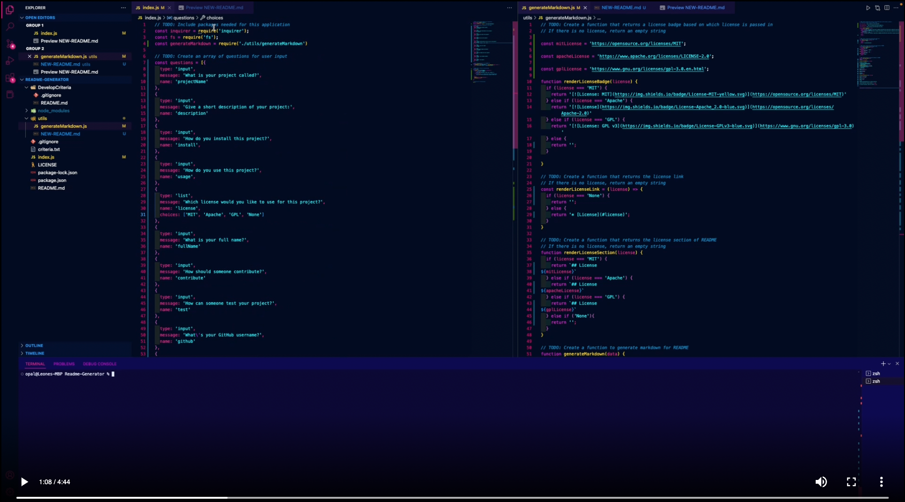

# Readme-Generator

## Description
A readme generator for developers who couldn't be bothered. Simply answer the questions in the terminal and let Node create a readme for you.

I created this primarily using Node.js and the Inquirer package. 

## Demonstration

## Installation
Download all files within this repository. 

Be sure to remember where you store these files for reference later.

## Usage
In order to run the program, navigate in the terminal to the folder that the program is stored in. Then run, 

    node index.js

This will begin a series of questions that will ask relevant questions to fill out your readme. The readme will then 
populate in the UTILS folder for you to make any final edits and export to your repository.

## Credits

University of Texas - Austin Coding Bootcamp.

[Inquirer Package](https://www.npmjs.com/package/inquirer)

[W3 Schools for JavaScript FS](https://www.w3schools.com/nodejs/nodejs_filesystem.asp)

[Stackoverflow.com]('https://stackoverflow.com)

## Contributing

You can use this for whatever you see fit.

For questions related to use, Please refer to [License](./LICENSE) in the repository.